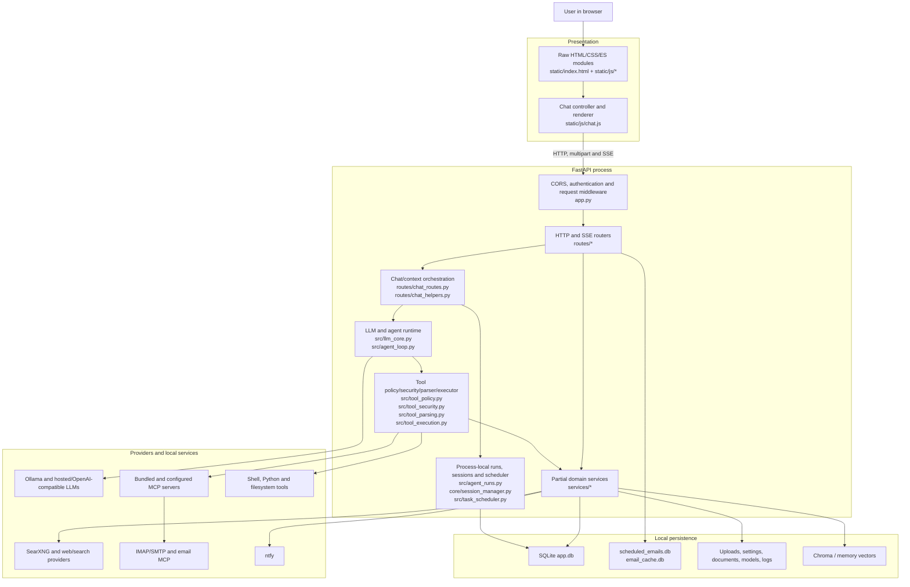
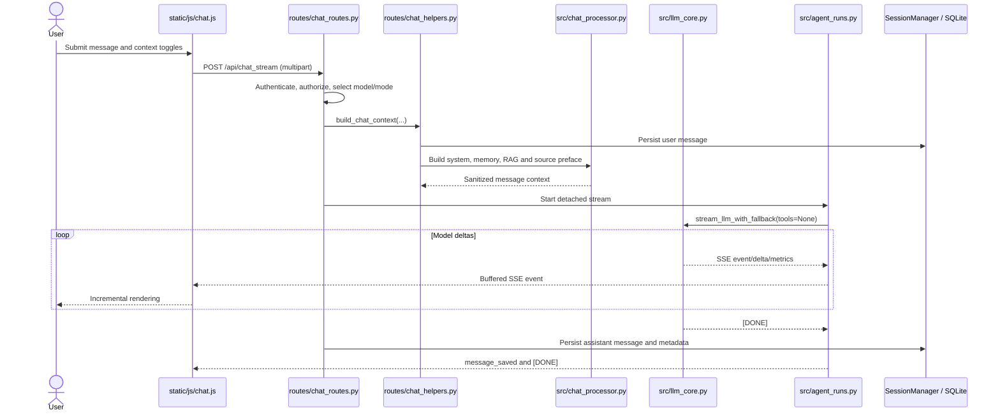
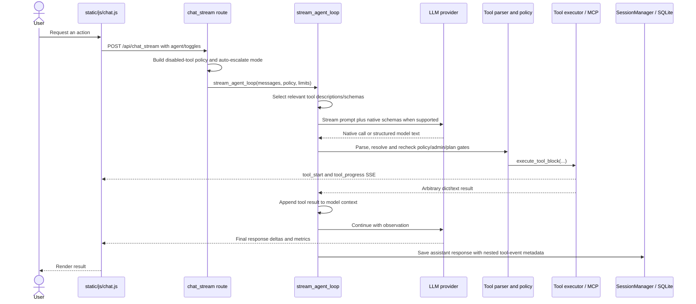

# Current Odysseus architecture

**Baseline:** `om-automate/main` at `9844a2f9a1996b8c8135a9e7bbde6a72f41df5ed`
**Purpose:** Record the system that exists before it is incrementally transformed into OM Automate.
**Related records:** [01-repository-audit.md](01-repository-audit.md), [04-agent-architecture.md](04-agent-architecture.md)

## Architectural character

The current application is a localhost-oriented FastAPI monolith with a raw JavaScript SPA, SQLite and file-based local persistence, optional Chroma/SearXNG/ntfy services, broad model-provider support, bundled and configurable MCP tools, and a process-local agent/scheduler runtime.

There are recognizable route, service, core and tool packages, but they are not strict layers. Routes perform application and persistence work; `src` mixes model, agent, policy and infrastructure concerns; core models can write through a global manager; and provider-specific behaviour is visible in orchestration code. The system should be evolved through compatibility-preserving seams rather than replaced wholesale.

## Current system diagram

The arrows describe current dependencies, not the desired direction. In particular, route and agent code can call low-level persistence or tool infrastructure without a domain service boundary.

## Startup and process lifecycle

### Composition root

`app.py` constructs the FastAPI application at line 121, configures CORS at `app.py:127-146`, installs authentication/request middleware around `app.py:255-469`, serves raw static modules through `_RevalidatingStatic` at `app.py:480-496`, builds shared managers, and registers routers at `app.py:628-858`.

The principal router groups include authentication, sessions, memory, skills, chat, research, history, search, personal documents, models, speech, documents, tasks, assistants, calendar, shell, workspace, MCP, webhooks, notes, email, Codex/Claude, vault, contacts and companion access.

Liveness and readiness are distinct:

- `/api/health` at `app.py:926-928` reports process liveness.
- `/api/ready` at `app.py:958-967` returns 503 until critical dependencies are ready.
- `_lifespan` at `app.py:991+` performs startup cleanup, manager startup and shutdown work.

The default direct/portable bind is `127.0.0.1:7000` (`launcher.py:128-142`, `app.py:1271-1276`). Docker exposes the same application port and waits for SearXNG and Chroma according to `docker-compose.yml`.

### Runtime state

The process owns several mutable singleton or process-global services:

- Session cache and lazy hydration: `core/session_manager.py`
- Detached chat run buffers: `src/agent_runs.py`
- Scheduled-task execution bookkeeping: `src/task_scheduler.py`
- MCP connections: `src/mcp_manager.py`
- Model, memory, skills, research and RAG managers constructed in `app.py`

This is suitable for one local process but is not worker-safe or restart-resumable. `app.py:104` explicitly notes that its rotating log handler is not multi-process safe.

## Frontend architecture

The browser client is a static SPA built from `static/index.html`, CSS, `static/app.js`, and feature modules under `static/js/`. It is served as source modules; there is no frontend build, typed API client, or generated SSE contract.

`static/js/chat.js` combines chat state, upload/context preparation, HTTP transport, SSE parsing, tool presentation, detached-run resume, response rendering and error recovery:

- Optimistic message and upload handling: `static/js/chat.js:950-1069`
- Document/email context collection: `:1122-1196`
- Multipart request fields and feature toggles: `:1166-1237`
- `/api/chat_stream` request and `AbortController`: `:1352-1358`
- Response reader: `:1405+`
- Line parser requiring the literal `data: ` prefix: `:1701-1742`
- Metrics, message, tool, progress, output and plan events: `:2448-2801`
- Final render and anti-stall Continue action: `:2920-2960`
- Detached-run resume via `/api/chat/resume`: `:3735-3755`

The client understands many ad hoc event shapes (`tool_start`, `tool_progress`, `tool_output`, `doc_update`, `ui_control`, `ask_user`, `plan_update`, `agent_step`) but they are not declared by one versioned schema. A server/client change can therefore fail silently at runtime.

### Frontend decision

- **Retain:** Current navigation, responsive shell, feature entry points, optimistic chat and SSE rendering.
- **Refactor:** Split the chat monolith into transport, run state, message rendering, action/approval cards and domain context modules. Define and test a versioned event union.
- **Replace:** Prose-only pending-action presentation and transport-specific business state. A framework migration is optional and should not block architectural safety work.

## Backend and API architecture

FastAPI routers are grouped by feature, but many own validation, application rules, manager calls, direct SQLAlchemy sessions and response shaping. There are 205 direct `SessionLocal`-family references across 25 route files.

Chat has two materially different endpoints:

- `/api/chat` (`routes/chat_routes.py:425-530`) validates ownership/model/privilege, builds context, optionally researches, calls `llm_call_async`, saves the response and schedules post-processing. It never runs the agent/tool loop.
- `/api/chat_stream` (`routes/chat_routes.py:535+`) supports plain chat, compare mode, agent-mode escalation, tools, SSE, detached execution and resume.

This endpoint drift means transport selection affects available behaviour. A future application use case should own chat execution, with sync/SSE/WebSocket adapters observing the same run.

`routes/chat_helpers.py` acts as an informal conversation service:

- `build_chat_context()` at `routes/chat_helpers.py:626-812`
- `add_user_message()` at `:431-438`
- `save_assistant_response()` at `:1010-1086`
- Post-response memory/skill extraction at `:1137+`

`src/chat_processor.py:198+` builds the context preface from system policy, preferences, memories, RAG, search sources and skills. `src/llm_core.py` then normalizes messages and handles provider-specific request/stream formats.

### Backend decision

- **Retain:** FastAPI, router separation, request validation and existing compatibility endpoints.
- **Refactor:** Introduce application commands/queries and repositories. Make routes thin and give sync/stream transports one execution service.
- **Replace:** Route-owned transaction/orchestration logic and hidden cross-package compatibility shims after callers have migrated.

## Persistence architecture

### Main relational store

`core/database.py:40-60` selects `DATABASE_URL`, defaulting to local SQLite `app.db`. The same 2,405-line module defines ORM types, engine/session setup and manual migrations. This makes import order, migration testing and domain ownership difficult.

`core/session_manager.py` combines an in-memory session cache with lazy SQLite hydration. A `core.models.Session` appears in-memory, but `Session.add_message()` at `core/models.py:94-107` calls the global manager's `_persist_message()`. The actual commit occurs at `core/session_manager.py:220-270`.

The normal chat persistence order is:

1. Persist user message while building context.
2. Execute the model/agent run.
3. Persist the assistant response on `[DONE]` or selected cancellation paths.
4. Store sources, metrics, model identity, thinking metadata and tool events inside message metadata.
5. Optionally extract memory and skills in asynchronous post-processing.

There is no first-class agent run/action/audit schema. Tool events are nested message metadata rather than independently queryable immutable records.

### Incognito contradiction

`routes/chat_helpers.py:431-438` and `:1010-1078` describe incognito messages as in-memory only, but both call `sess.add_message()`, which persists through the global manager. Incognito session rows/messages are removed later by session cleanup (`routes/session_routes.py:217-249` and startup cleanup in `app.py:1007+`). Current behaviour is deferred deletion, not non-persistence.

### Other stores

- Scheduled email and email cache databases are separate files under `DATA_DIR`.
- Settings, presets, contacts, integration configuration and other state also use JSON/files.
- Uploads, documents, generated assets, logs and model caches use local directories.
- RAG and memory retrieval use Chroma and/or local vector stores.

### Persistence decision

- **Retain:** SQLite local-first default and existing user data.
- **Refactor:** Split ORM models, migration runner and repositories; add durable run/action/approval/audit tables through additive migrations.
- **Replace:** Global model write-through and deferred-delete incognito semantics.

## Integration architecture

### Model providers

`src/llm_core.py:817-852` detects Ollama, Anthropic, OpenCode, OpenRouter, Groq, Nvidia, Moonshot, ChatGPT subscription, Copilot, Cerebras, Mistral and default OpenAI-compatible providers. `LLMConfig` defines request, retry and stream defaults; `stream_llm_with_fallback()` at `src/llm_core.py:2738-2804` only changes provider before visible output, then emits a visible fallback event.

Provider differences are partly normalized in `llm_core`, but native tool support is also inferred in `src/agent_loop.py:3002-3073` from database flags, URL patterns and model names. Ollama defaults to structured text unless explicitly opted into native tools.

### MCP and effectful providers

`src/mcp_manager.py` starts/connects bundled or configured MCP servers and qualifies names as `mcp__<server>__<tool>`. `src/tool_execution.py` contains the final legacy/built-in/MCP dispatch chain. Bundled servers include email, image generation, memory and RAG.

The email MCP stages confirmation-required sends as `agent_draft` records (`mcp_servers/email_server.py:1119-1225`) and backend routes expose pending-list/approve/cancel operations (`routes/email_routes.py:3641-3710`). MCP conversion reduces the structured pending result to prose (`mcp_servers/email_server.py:2344-2367`), and the frontend has no corresponding generic pending-action component.

### Search, vectors and notifications

- SearXNG is the local metasearch service.
- Other configured search providers include Brave, Google PSE, Tavily, Serper and web access helpers.
- Chroma provides local RAG/vector storage.
- ntfy provides optional notification delivery.
- IMAP/SMTP, CalDAV, local shell/filesystem, speech and model-serving integrations are exposed through routes/services/tools with varying abstraction quality.

### Integration decision

- **Retain:** Existing provider support and MCP protocol compatibility.
- **Refactor:** Put providers behind calendar/email/transcription/knowledge/etc. interfaces owned by domains. Convert provider results to typed application results.
- **Replace:** Provider-specific approval, verification and retry logic embedded in MCP/tool/route code.

## Security architecture

### Existing controls to retain

- CORS is configurable and localhost-limited by default (`app.py:127-146`).
- Authentication middleware protects API/static paths and distinguishes explicitly public endpoints (`app.py:255-469`).
- Coarse feature privileges are defined in `core/auth.py:25-41`.
- External search/page/RAG content is wrapped as untrusted by `src/prompt_security.py:8-86`.
- Filesystem resolution checks allowed roots, workspace realpaths and sensitive paths in `src/tool_execution.py:43-278` and `src/agent_tools/filesystem_tools.py`.
- Tool execution rechecks disabled/admin/plan gates in `src/tool_execution.py:680-712`, not only at prompt construction.
- `src/tool_security.py:40-75` restricts powerful tools for non-admins; `:88-161` adds plan-mode read-only and mutation backstops.
- DNS-rebinding transport behaviour has a focused regression test.

### Material gaps

- There are no granular domain scopes such as `email.send` or `calendar.delete`; current privileges are coarse feature flags.
- There is no general risk classifier or policy-generated confirmation record.
- Non-native structured model text can directly select executable tools.
- Native tool schemas define input parameters but not output, risk, permission, timeout, retry, reversibility, idempotency, audit or compensation contracts.
- Important effect verification is optional, snapshot-based and fail-open rather than provider readback.
- Detached runs are not durable and Stop does not reliably cancel the child tool.
- Incognito content reaches SQLite.
- Tool-event metadata is not a complete immutable audit record: it lacks actor, policy decision, approval, idempotency, provider readback and compensation state.

## Ordinary chat trace

### Exact ordinary-response trace

1. `static/js/chat.js:950-1237` creates the optimistic bubble and request fields.
2. `static/js/chat.js:1352-1358` posts to `/api/chat_stream` with timezone headers and an `AbortController`.
3. `routes/chat_routes.py:535-1008` validates the request and computes mode/effective tool policy.
4. `routes/chat_helpers.py:626-812` preprocesses input, persists the user message, retrieves memory/skills/RAG and trims context.
5. `src/chat_processor.py:198+` constructs the preface and untrusted source sections.
6. Plain chat enters `stream_llm_with_fallback(..., tools=None)` at `routes/chat_routes.py:1237-1270`.
7. `src/llm_core.py:2076+` streams provider-normalized events; fallback is allowed only before content.
8. `src/agent_runs.py:141-204` buffers and republishes the detached stream.
9. `static/js/chat.js:1701-1742,2448-2960` parses events and updates the visible response.
10. `routes/chat_routes.py:1491-1521` saves the assistant message when the run reaches `[DONE]`.

## Tool-response trace

### Exact tool-response trace

1. `routes/chat_routes.py:591-612` may escalate chat to agent mode based on action/search intent.
2. `routes/chat_routes.py:873-1008` combines feature toggles, incognito/email context, privilege gates and global disabled tools.
3. `routes/chat_routes.py:1380-1432` invokes `stream_agent_loop`; a configured zero tool-call limit means unlimited calls and rounds may reach 200.
4. `src/agent_loop.py:2746+` uses `ToolIndex`; `src/tool_index.py:142-180,590-616` degrades to keyword selection when embeddings are unavailable.
5. `src/agent_loop.py:3002-3073` decides whether the provider supports native calls; `:3293-3340` filters schemas.
6. `src/agent_loop.py:_resolve_tool_blocks` (`:2175-2223`) prefers native calls but permits structured-text parsing for non-native providers.
7. `src/tool_parsing.py:1235-1407` recognizes fences, XML/invoke, DSML and multiple raw JSON dialects.
8. `src/tool_execution.py:570-962` rechecks policy/security and dispatches to the new handler map, legacy branches or MCP.
9. `src/agent_loop.py:3957-4025` emits progress and executes the child tool task.
10. `src/agent_loop.py:_append_tool_results` (`:2226-2305`) adds native `tool` messages or wrapped text-model results and asks the model to continue.
11. `src/agent_loop.py:4308-4334` records a limited tool-event structure in assistant metadata.
12. `routes/chat_routes.py:1491-1521` persists the final assistant message; detached events remain resumable only while the process/run buffer survives.

## Testing and operational architecture

`pyproject.toml` defines markers for security, routes, services, CLI, JavaScript, helpers, unit, uncategorized and slow tests. JavaScript behaviour is tested by launching Node from pytest rather than by a separate frontend runner.

CI performs Python compilation and Node syntax checks, plus dependency, secret, workflow and container-image scanning. The full pytest command is informational because `.github/workflows/ci.yml:109` sets `continue-on-error: true`.

Focused audit results and known isolation defects are recorded in [01-repository-audit.md](01-repository-audit.md#test-evidence). Missing high-value coverage includes:

- In-flight tool cancellation and process cleanup
- Restart between provider side effect and local completion
- Idempotent replay/duplicate suppression
- Generic approval lifecycle and authorization
- True incognito database non-persistence
- Typed tool registry consistency
- Provider readback verification and compensation
- Browser-level SSE/resume and approval-centre flows

## Current architecture conclusion

The system already has valuable local-first infrastructure, feature breadth, provider reach, prompt-injection marking, file confinement and a large test base. Its limiting issue is not lack of features; it is that orchestration, policy, execution and persistence do not yet form a durable, typed safety boundary. OM Automate should preserve user-visible behaviour while moving every GUI, agent, schedule, API, MCP and webhook action through shared application/domain services.
