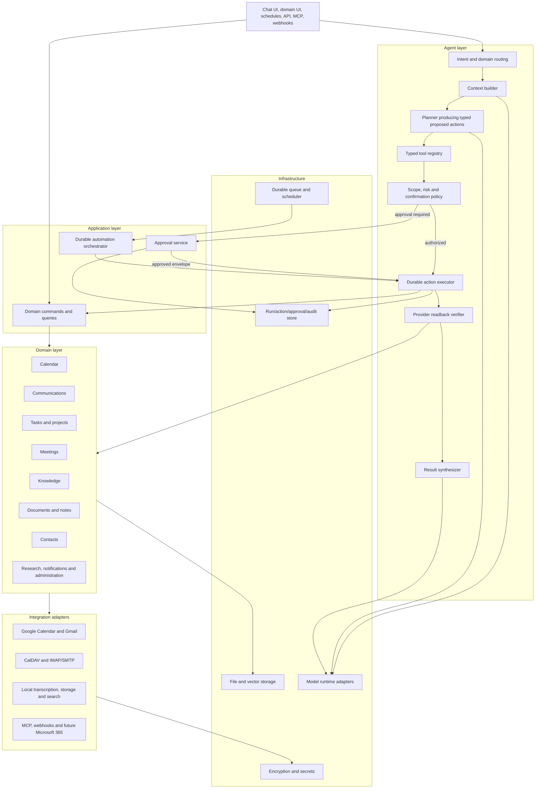
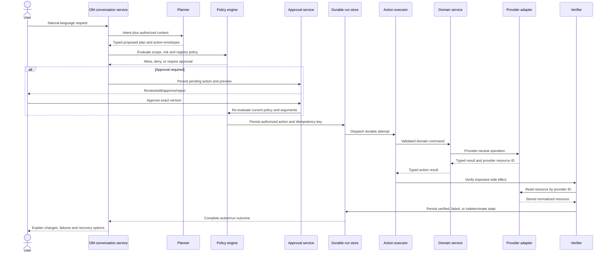
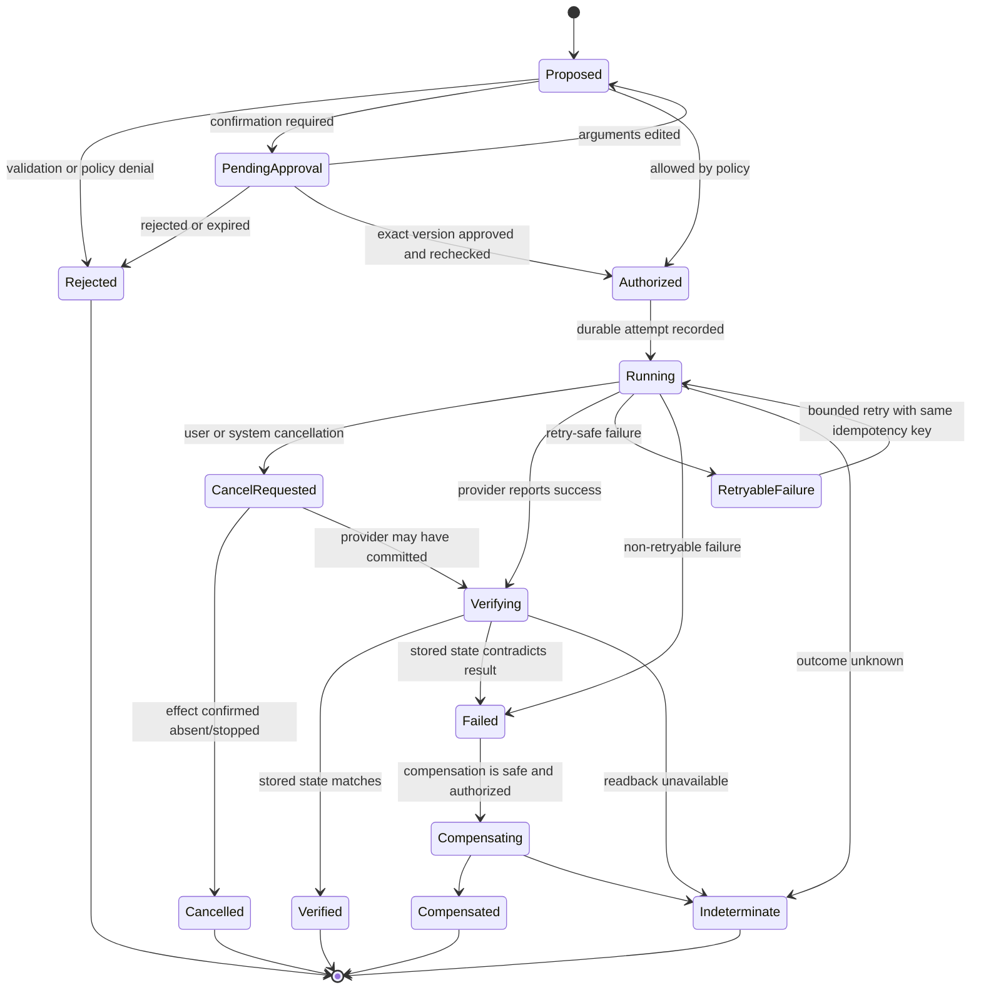

# OM Automate agent architecture

**Baseline inspected:** `om-automate/main` at `9844a2f9a1996b8c8135a9e7bbde6a72f41df5ed`
**Status:** Current implementation documented; target architecture is a design contract and is not yet implemented.
**Detailed current traces:** [02-current-architecture.md](02-current-architecture.md#ordinary-chat-trace) and [02-current-architecture.md](02-current-architecture.md#tool-response-trace)

## Purpose

OM is the single primary user-facing companion for OM Automate. It must help with calendar, communication, tasks, meetings, knowledge, documents, contacts, administration, research and automations without becoming a privileged shortcut around the corresponding domain services.

The agent boundary must guarantee:

1. Model output is untrusted data, never executable authority.
2. Every action is a typed command validated independently of the model.
3. Permission and risk policy is evaluated immediately before execution.
4. Consequential actions have reviewable approval records.
5. Durable state is written before external side effects.
6. Replays cannot silently duplicate effects.
7. Important effects are verified by reading the provider state back.
8. Cancellation reaches the actual operation and is recorded truthfully.
9. Partial success is explicit and safe to resume or compensate.
10. Every action has an immutable, user-visible audit trail.

## Current agent implementation

### Existing component map

| Concern | Current implementation | Observed behaviour | Decision |
|---|---|---|---|
| Chat transport | `static/js/chat.js`; `routes/chat_routes.py` | Multipart POST and SSE. Normal streams are detached and resumable within the process. | **Retain and type.** Define a versioned event union and make transport observe a durable run. |
| Context assembly | `routes/chat_helpers.py:626-812`; `src/chat_processor.py:198+` | Adds user message, preferences, memories, skills, RAG, search/page context, then compacts/trims history. | **Retain behaviour, refactor ownership.** Move to an agent context service using domain queries. |
| System/tool prompt | `src/agent_loop.py:1-140` and context preface builders | Tells the model how to emit tool blocks and claims a 60-second timeout. | **Replace executable-text instructions.** Keep safety/persona content, expose capabilities through typed schemas only. |
| Model provider | `src/llm_core.py`; provider detection at `:817-852` | Normalizes many local/hosted providers, retry and streaming formats. | **Retain behind a provider adapter.** Provider capability must be declared, not guessed throughout orchestration. |
| Tool selection | `src/tool_index.py`; selection in `src/agent_loop.py:2746+` | Semantic selection with keyword fallback; can degrade if embeddings are unavailable. | **Retain as advisory retrieval.** It may reduce schemas, but cannot grant permission. |
| Native schema exposure | `src/tool_schemas.py` | OpenAI-style input parameter schemas only. | **Replace source of truth.** Generate provider schemas from the typed registry. |
| Text-call parsing | `src/tool_parsing.py:1235-1407` | Parses fenced, XML, DSML and raw JSON formats from model prose. | **Remove from executable path.** It may remain temporarily for non-effectful compatibility parsing behind a feature flag. |
| Call resolution | `src/agent_loop.py:_resolve_tool_blocks`, `:2175-2223` | Native calls preferred; non-native structured text can become a tool block. | **Replace with validated action-envelope decoding.** |
| Policy | `src/tool_policy.py`; `src/tool_security.py` | Per-turn denylist, hidden tools, guide-only/block-all, coarse admin and plan read-only checks. | **Retain as defence-in-depth, replace as primary policy.** Add scope, resource, risk and approval evaluation. |
| Execution | `src/tool_execution.py:570-962` | Common wrapper followed by new-handler, legacy branch and MCP dispatch; returns arbitrary dict/text values. | **Refactor behind one executor and domain commands.** Remove parallel registries/dispatch paths. |
| Tool loop | `src/agent_loop.py:2541-4475` | Model chooses actions, tool results are appended, loop breaker detects repetition, then model synthesizes a final answer. | **Refactor into planner/orchestrator/executor/result synthesizer.** Preserve streaming and loop-breaker concepts. |
| Verification | `_run_verifier_subagent`, `src/agent_loop.py:2408+` | Optional for a small effectful set; compares snapshots; fails open. | **Replace for important effects with deterministic provider readback.** LLM verification may supplement, never substitute. |
| Detached execution | `src/agent_runs.py` | Process-local event list, 180-second terminal retention, no restart recovery. | **Replace with durable run/event state; retain an in-memory fan-out cache.** |
| Scheduling | `src/task_scheduler.py`; `TaskRun` in `core/database.py:651+` | Durable task/run rows but process-local execution; stale runs are aborted, not resumed. `TaskRun.steps` is unused. | **Refactor as one caller of the shared automation/agent orchestrator.** |
| Audit | Tool events in assistant message metadata, `src/agent_loop.py:4308-4334` | Records round/tool/command/output/exit status and selected artifacts. | **Replace with first-class immutable run/action/policy/approval/verification records.** |
| Email confirmation | `mcp_servers/email_server.py:1119-1225`; `routes/email_routes.py:3641-3710` | Stages pending email in a separate DB; no complete generic frontend flow. | **Migrate into generic approval service.** |

### Current lifecycle

The implemented agent path is:

```text
User request
→ chat.js multipart request
→ /api/chat_stream authentication and mode selection
→ context assembly and user-message persistence
→ disabled-tool policy construction
→ ToolIndex relevance selection
→ provider/native-tool capability inference
→ LLM stream
→ native-call or model-text parsing
→ denylist/admin/plan checks
→ built-in, legacy or MCP execution
→ progress/result SSE
→ tool result appended to model context
→ repeat until final answer, loop breaker or round limit
→ assistant message and nested tool metadata persistence
→ browser render
```

Exact paths and line references are in the tool-response trace in `02-current-architecture.md`.

### Current safeguards

- Untrusted search, page and RAG context is explicitly delimited by `src/prompt_security.py:8-86`.
- Native provider calls are preferred when available.
- Effective disabled-tool policy is built at `routes/chat_routes.py:873-1008`.
- Execution rechecks policy/admin/plan restrictions at `src/tool_execution.py:680-712`.
- Non-admin and plan-mode backstops live in `src/tool_security.py:40-161`.
- Workspace and sensitive-path checks live in `src/tool_execution.py:43-278` and filesystem tools.
- Repeated signatures and stalled rounds trigger a loop breaker at `src/agent_loop.py:3864-3920`.
- Text-model tool results are wrapped as untrusted context by `_append_tool_results()` at `src/agent_loop.py:2226-2305`.
- Provider fallback is visible and only happens before visible output (`src/llm_core.py:2738-2804`).

These controls should remain as defence-in-depth while the execution boundary is replaced.

## Confirmed current-agent blockers

### 1. Free-form model output is executable

`src/tool_parsing.py:1235-1407` recognizes many structures embedded in model text. `_resolve_tool_blocks()` at `src/agent_loop.py:2175-2223` converts those structures into executable blocks for non-native providers. The prompt itself teaches fenced execution (`src/agent_loop.py:1-140`). This violates the requirement to avoid direct execution from raw model text.

**Required change:** Only a provider adapter may produce a candidate `ActionEnvelope`; it must pass strict schema validation, registry lookup, permission/risk policy and persistence before execution. Ordinary assistant prose must have no route to the executor.

### 2. Baseline Stop defect: local child ownership fixed in SAFE-001

At the audited baseline, `src/agent_loop.py` created `_tool_task = asyncio.create_task(_run_tool())`. The outer generator consumed progress and awaited the child but had no `finally` block that cancelled and awaited it. `src/agent_runs.py` cancelled the detached outer task only.

SAFE-001 now routes tool execution through `src/tool_run_lifecycle.py:CancellableToolRun`. `stream_agent_loop()` owns that lifecycle in `try/finally`, so explicit detached-run cancellation closes, cancels, and awaits a still-running child. A deterministic browser probe stopped `sleep 20; touch <marker>` while it was running; after the original deadline the marker did not exist. The tool card now settles as `cancelled` rather than retaining a stale `Running` label.

**Remaining required change:** Local cancellation cannot prove whether a remote provider already committed an effect. The durable action work must atomically record `cancel_requested`, signal the concrete executor/provider, apply a bounded deadline, read provider state back, and record whether the effect was cancelled, completed, partial, or indeterminate.

### 3. Registry and import drift

Tool metadata is spread across `FUNCTION_TOOL_SCHEMAS`, `TOOL_TAGS`, `TOOL_HANDLERS`, `TOOL_SECTIONS`, `BUILTIN_TOOL_DESCRIPTIONS`, a legacy `elif` chain and MCP discovery. A runtime inventory found 74 distinct names but only 27 common to every collection.

The drift is observable: `tail_serve_output` is exposed at `src/tool_schemas.py:855`, omitted from `TOOL_TAGS`, and rejected by `function_call_to_tool_block()` at `:1333-1335`.

A clean `import src.tool_schemas` also fails through a circular dependency unless `src.agent_tools` is imported first. Import-order workarounds are documented at `src/tool_execution.py:629-638` and `src/tool_security.py:173-179`.

**Required change:** One acyclic registry owns all metadata and the callable binding. Provider schemas, search descriptions, UI copy and audit labels are derived views.

### 4. Approval is not an agent-wide primitive

Current policy is a denylist and coarse administrator check. The guide-only matcher in `src/tool_policy.py:125-175` interprets a request such as “ask for confirmation before using tools” as block-all rather than creating pending approvals. `ask_user` is model-requested clarification, not policy confirmation.

Email has a special pending-draft backend but no generic approval UI. Other consequential tools have no common pending-action record.

**Required change:** The policy engine, not the model or individual provider, creates approval requirements and immutable pending-action records.

### 5. Runs are neither durable nor idempotent

`src/agent_runs.py:1-42` explicitly holds run state in memory. The user message is saved before execution, but action checkpoints are not. A crash after an external provider commits and before assistant persistence can lead to an unsafe replay.

**Required change:** Persist run, plan and action attempt before execution; pass stable idempotency keys to providers where supported; reconcile uncertain attempts by provider lookup before retry.

### 6. Verification is optional and fail-open

The verifier at `src/agent_loop.py:2408+` applies only to a small hard-coded set and compares snapshots. It does not establish that Gmail, Calendar or another provider actually stored the requested state.

**Required change:** Each consequential tool defines a deterministic verification strategy that reads the resource back by provider ID and compares normalized requested/stored state.

### 7. Timeout and execution budget are inconsistent

- Prompt claim: 60 seconds (`src/agent_loop.py:116`)
- Legacy shell/Python constants: 60/30 seconds (`src/agent_tools/__init__.py:71-73`)
- Actual subprocess defaults: one hour (`src/agent_tools/subprocess_tools.py:8-9,117,143`)
- Route defaults: zero means unlimited tool calls, with up to 200 rounds (`routes/chat_routes.py:1393-1403`)

**Required change:** Timeouts, retries and budgets are registry/policy values enforced by one executor and surfaced to the UI.

## Target architecture



### Dependency rule

The agent calls application use cases. Application use cases call domain services. Domain services call provider interfaces. Neither the model, agent loop, route, MCP server nor UI may manipulate a domain table or external provider directly.

The same use case must serve:

- Graphical domain screens
- Companion chat
- Scheduled routines
- External API endpoints
- MCP servers
- Webhooks
- Future mobile clients

This prevents the chat agent from becoming a parallel privileged backend.

## Target execution lifecycle



### Required stages

1. Understand intent without granting authority.
2. Identify relevant domains.
3. Retrieve only permitted context.
4. Produce an internal typed plan.
5. Validate every argument against the registry schema and domain invariants.
6. Evaluate scopes, resources and risk.
7. Persist and obtain confirmation when required.
8. Persist an authorized attempt and stable idempotency key.
9. Execute through an application/domain service.
10. Verify important effects through provider readback.
11. Recover, safely retry or compensate after partial failure.
12. Synthesize a truthful response and save the audit record.

## Typed tool registry contract

One registry entry must own all information needed by the model adapter, policy engine, executor, approval UI, audit viewer and tests.

```python
@agent_tool(
    name="calendar.create_event",
    description="Create one calendar event",
    input_model=CreateCalendarEventCommand,
    output_model=CalendarEventResult,
    domain="calendar",
    permissions=("calendar.write",),
    risk=RiskLevel.LOW_REVERSIBLE,
    confirmation=ConfirmationPolicy.CONDITIONAL,
    reversible=True,
    timeout_seconds=20,
    retry=RetryPolicy(max_attempts=2, retryable=(TimeoutError,)),
    idempotency=IdempotencyPolicy.PROVIDER_OR_LOCAL_KEY,
    audit_fields=("calendar_id", "title", "starts_at", "attendees"),
    verifier="calendar.read_created_event",
    compensator="calendar.delete_created_event",
)
async def create_event(command: CreateCalendarEventCommand) -> CalendarEventResult:
    ...
```

Every entry must define:

- Stable tool name and version
- Human-readable description
- Input and output schema
- Domain owner
- Required scopes
- Risk level
- Confirmation rule
- Reversibility and compensation
- Timeout and retry policy
- Idempotency behaviour
- Audit-safe fields and redaction policy
- Verification strategy
- Example success and failure values for tests/UI
- Concrete application handler binding

Provider schema exposure is a generated projection of this registry. Tool search/index descriptions and approval previews are also projections. Startup validation must fail closed on duplicate names, missing handlers, invalid schemas or incompatible metadata.

## Permission scopes

Initial scopes are:

```text
calendar.read        calendar.write       calendar.delete
email.read           email.draft          email.send          email.archive
tasks.read           tasks.write          tasks.delete
meetings.record      meetings.transcribe
knowledge.read       knowledge.write
contacts.read        contacts.write
files.read           files.write
research.web
automation.create    automation.execute
shell.execute
admin.settings
```

Policy evaluation must include actor, tool version, requested resource/account, current integration grant, conversation/run, schedule/webhook/API provenance, and any narrowly scoped “always allow” rule. Administrator status alone must not imply every scope.

Scopes control capability, not risk. Possessing `email.send` allows the operation to be considered; it does not waive required confirmation.

## Risk and confirmation policy

| Level | Meaning | Examples | Default |
|---|---|---|---|
| **0 — read-only** | No intended external mutation | Read calendar, search email, query knowledge, summarize a document | Execute when scope exists; still apply privacy and rate limits. |
| **1 — low-risk reversible** | Local or easily reversible mutation | Create draft/task/note, add label, tentative event | May auto-execute only when trusted-action policy narrowly allows it. |
| **2 — consequential external** | Communicates externally or changes commitments/shared state | Send email, invite attendee, modify meeting, share document, recurring automation | Confirmation required by default. Show exact preview and affected records. |
| **3 — destructive or highly sensitive** | Destructive, privileged, bulk, export or arbitrary execution | Delete records, shell, security settings, bulk edits, private-data export, revoke integration | Always explicit confirmation. No broad “always allow” waiver. |

Risk can be raised dynamically. For example, `calendar.create_event` may be Level 1 without attendees and Level 2 when it sends invitations. Bulk count, sensitive recipients, security settings, external sharing and shell metacharacter/arbitrary-code capability can only raise risk.

## Approval centre

The approval centre is an application service and UI, not a chat-text convention. A pending action must contain:

- Stable action ID, run ID and conversation link
- Registry tool/version and domain
- Redacted but exact argument preview
- Affected account/resources
- Risk level and policy reason
- Requesting actor and origin
- Creation and expiration times
- Edit/version history
- Approve-once, reject and permitted narrow “always allow” options
- Current action status and completed verification result

Approval binds to a cryptographic or canonical hash of the action version. Editing arguments invalidates the prior approval and triggers validation/risk evaluation again. Execution must recheck scopes, integration state, expiration and policy at dispatch time to prevent time-of-check/time-of-use errors.

The existing email pending-draft records should be migrated through a compatibility adapter; they must not remain a second approval system.

## Durable runs and action state

### Proposed records

- `agent_runs`: actor, origin, conversation, intent, status, budgets, context reference and timestamps
- `agent_plans`: versioned internal plan and dependencies
- `agent_actions`: typed tool/version, canonical input, risk, scope decision, approval requirement, idempotency key and dependency edges
- `action_attempts`: attempt number, dispatch/timeout/cancellation state, provider request/resource IDs and normalized result
- `approvals`: action version/hash, decision, actor, policy, expiration and argument edits
- `verifications`: requested state, observed state, verifier and result
- `compensations`: trigger, command, attempt and outcome
- `agent_events`: append-only, redacted event stream for UI resume and audit

### Action state machine



An `Indeterminate` action must never be presented as successful or automatically retried unless provider reconciliation proves the original effect absent.

## Timeout, retry, cancellation and idempotency

- Registry timeout is an upper bound enforced around the concrete handler, not merely promised in a prompt.
- Cancellation propagates from run to action, provider client and subprocess. Cleanup is bounded and awaited.
- Retries apply only to classified transient failures and respect the action's idempotency policy.
- A stable idempotency key is created before the first attempt and reused across safe retries.
- Provider-supported keys are passed through. Otherwise, local uniqueness plus provider reconciliation is required.
- Action and run budgets limit rounds, actions, elapsed time and provider spend. Zero must not ambiguously mean unlimited in production policy.
- Independent successful steps remain complete when another branch fails. Unsafe dependents do not start.
- Compensation is itself a typed, policy-checked, audited action; it is never an unrecorded rollback callback.

## Tool-result verification

Verification must be deterministic where a provider supports readback:

```text
Create/update action
→ receive provider resource ID/version
→ retrieve the resource using a read adapter
→ normalize requested and stored values
→ compare domain-significant fields
→ persist Verified, Failed, or Indeterminate
→ report the evidence to the user
```

Examples:

- Calendar create: read event ID; compare calendar, start/end, timezone, title and attendees.
- Email send: resolve provider message ID and sent-folder/thread state without sending again.
- Task update: read task/version and compare requested fields.
- Document share: inspect current ACL rather than trusting a 200 response.
- Shell/filesystem action: validate exit status and expected artifact, while treating arbitrary side effects as non-reversible.

LLM-based critique may identify semantic anomalies, but cannot mark an external effect verified.

## Context and prompt-injection boundary

The existing untrusted-context markers should be retained. The target context builder must additionally:

- Retrieve through scoped domain queries.
- Label provenance, tenant/account, age and trust level.
- Minimize private context to the current intent.
- Keep tool results untrusted, including native `role=tool` messages.
- Prevent retrieved text from changing scopes, risk, approvals or registry metadata.
- Redact secrets and approval-only fields from model context.
- Summarize/truncate history with explicit token budgets and preserve unresolved action state separately from prose history.

No prompt instruction can grant a permission or waive policy. Only authenticated application state can do so.

## Local and hosted model behaviour

The current provider breadth in `src/llm_core.py` should remain, but capability negotiation must become explicit:

- `supports_native_tools`
- `supports_strict_json_schema`
- `supports_streaming_tool_arguments`
- Context and output token limits
- Timeout/retry semantics
- Data-residency/privacy classification

Models without trustworthy structured action output may plan in prose but cannot directly request effectful execution. A constrained local action-decoder model or deterministic UI flow may translate a user-approved plan into candidate envelopes; the same validation and policy boundary still applies.

Provider fallback must remain visible. An in-progress plan/action must not silently move to a provider with a different privacy classification.

## Events and user experience

Replace ad hoc SSE dictionaries with a versioned discriminated union, including:

- `run.started`, `run.status`, `run.completed`, `run.failed`
- `plan.proposed`, `plan.updated`
- `action.proposed`, `action.awaiting_approval`, `action.started`
- `action.progress`, `action.retrying`, `action.cancel_requested`
- `action.verified`, `action.failed`, `action.indeterminate`, `action.compensated`
- `approval.created`, `approval.updated`, `approval.decided`, `approval.expired`
- `message.delta`, `message.completed`
- `usage.updated`

Every event carries run/action IDs, monotonic sequence, schema version, timestamp and redacted payload. Resume uses the durable sequence cursor; the in-memory fan-out cache is only an optimization.

The final response must distinguish:

- Planned but not executed
- Awaiting approval
- Executed and verified
- Executed but verification unavailable
- Failed before effect
- Indeterminate after possible effect
- Compensated

## Migration plan

### Stage A — stabilize the existing boundary

1. Fix child-tool cancellation and add regression tests.
2. Resolve the `tool_schemas` circular import and add a registry-consistency test.
3. Normalize enforced timeout/budget defaults.
4. Add true incognito non-persistence tests and implementation.
5. Make focused pytest suites isolated and CI-gating.

### Stage B — introduce typed compatibility seams

1. Add typed registry definitions alongside existing tools.
2. Generate existing provider schemas and tool-index descriptions from the registry.
3. Wrap existing handlers/MCP tools as typed application handlers.
4. Add output validation and redaction without changing visible behaviour.
5. Feature-flag structured-text execution off, starting with consequential tools.

### Stage C — durable actions and approvals

1. Add additive run/action/approval/event tables and migrations.
2. Make chat, schedules, API, MCP and webhooks create the same action records.
3. Build the approval centre and migrate pending email drafts.
4. Add idempotency and provider reconciliation.
5. Make SSE resume read durable events.

### Stage D — domain and provider separation

1. Move tools onto calendar/email/task/meeting/knowledge/document/contact services.
2. Implement provider-neutral Google, CalDAV, IMAP/SMTP and local adapters first.
3. Prevent route/agent direct DB/provider access through dependency tests.
4. Add provider readback and compensation strategies.

### Stage E — remove compatibility paths

1. Disable and delete executable fenced/XML/DSML/raw-JSON parsing after supported models use envelopes.
2. Remove legacy dispatch chains and duplicate metadata maps.
3. Remove the email-specific approval store after data migration.
4. Remove process-local run truth after durable events are proven.

Every stage requires application startup, migration compatibility, focused and full tests, browser smoke testing, and a Git checkpoint.

## Required agent test matrix

| Area | Required proof |
|---|---|
| Registry | Every registered tool has one handler and complete schemas/policy metadata; generated provider schema round-trips. |
| Untrusted output | Fenced, XML, DSML and raw JSON in assistant prose never execute. Malicious tool results cannot grant scope. |
| Permissions | Each scope allow/deny path; admin does not implicitly bypass risk confirmation. |
| Risk | Static and dynamically raised risk; Level 2/3 cannot execute without valid exact-version approval. |
| Approval | Approve, reject, edit/revalidate, expire, narrow allow rule, revoked integration, concurrent decision. |
| Idempotency | Timeout/retry/restart after provider commit does not duplicate an email, event, task or document action. |
| Verification | Success, mismatch, provider outage and indeterminate state for each consequential adapter. |
| Cancellation | Stop before dispatch, during provider call, during subprocess, after provider commit and during verification. |
| Recovery | Independent partial success, blocked dependents, safe resume and compensation failure. |
| Persistence | Restart at every state-machine transition; monotonic event replay; no lost audit rows. |
| Privacy | Incognito leaves no content in DB/files/logs/vector stores; redaction in events and audit views. |
| Providers | Local/native, local/non-native and hosted providers obey the same action boundary and privacy/fallback policy. |
| UI | Browser approval centre, action edits, exact preview, resume, cancellation and indeterminate-state messaging. |

Current focused evidence is recorded in [01-repository-audit.md](01-repository-audit.md#test-evidence). Child-tool cancellation now has focused lifecycle tests, existing detached-run regression coverage, a DOM status regression, and a deterministic browser shell probe. There is still no complete test for generic approval, restart-safe action replay/provider reconciliation, or true incognito database non-persistence.

## Architecture decision

Retain the existing conversation UI, context sources, provider reach, streaming experience, untrusted-content marking, path confinement, relevance-based tool selection and loop-breaker ideas. Refactor them behind explicit agent/application/domain boundaries. Replace raw-text execution, fragmented registries, bespoke confirmation, process-local run truth and metadata-only auditing before OM is permitted to perform broad consequential personal operations.
